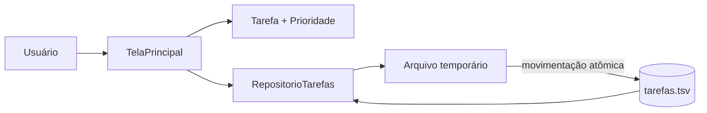
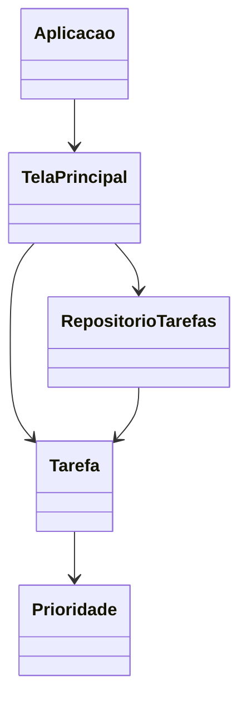

# Gerenciador de tarefas em Java Swing

[](https://github.com/r-menegueli/gerenciador-tarefas-java/actions/workflows/ci.yml)


Aplicação desktop para cadastrar, editar, concluir e remover tarefas com prioridades. Os registros são persistidos localmente e restaurados na inicialização.

## Funcionalidades

- criação e edição com validação de títulos vazios;
- prioridades baixa, média e alta;
- conclusão e reabertura de tarefas;
- confirmação antes da exclusão;
- identificadores UUID estáveis;
- persistência atômica em UTF-8;
- títulos codificados para preservar caracteres especiais;
- teste automatizado de gravação e leitura.



## Execução

Requer JDK 17 ou superior.

```bash
mkdir -p build
javac -encoding UTF-8 -d build src/main/java/io/github/rmenegueli/tarefas/*.java
java -cp build io.github.rmenegueli.tarefas.Aplicacao
```

No Windows, crie a pasta `build` antes de executar os mesmos comandos. Os dados são gravados em `.gerenciador-tarefas/tarefas.tsv` dentro da pasta do usuário.

## Teste

```bash
javac -encoding UTF-8 -Xlint:all -Werror -d build \
  src/main/java/io/github/rmenegueli/tarefas/*.java \
  src/test/java/io/github/rmenegueli/tarefas/*.java
java -cp build io.github.rmenegueli.tarefas.RepositorioTarefasTeste
```

A integração contínua repete essa compilação rigorosa e o teste de persistência em cada alteração.

## Estrutura



O projeto usa somente a biblioteca padrão do Java, sem dependências externas ou arquivos gerados pelo editor visual do NetBeans.
