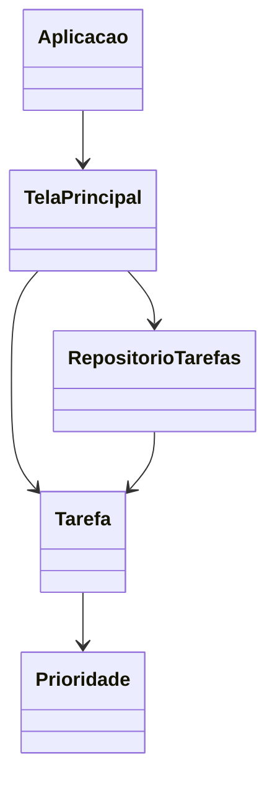

# Gerenciador de tarefas em Java Swing

Aplicação acadêmica desktop para cadastrar, editar, concluir e remover tarefas com prioridades. Os dados são persistidos localmente em um arquivo UTF-8.

## Melhorias da curadoria

- interface refeita sem dependência do editor visual do NetBeans;
- validação de títulos vazios;
- persistência atômica com `try-with-resources`;
- títulos codificados antes da gravação, permitindo caracteres especiais;
- identificadores estáveis para as tarefas;
- confirmação antes da exclusão;
- suporte a marcar tarefas como concluídas;
- teste automatizado de gravação e leitura.

## Requisitos e execução

Requer JDK 17 ou superior.

```bash
javac -encoding UTF-8 -d build src/main/java/br/com/darkramuza/tarefas/*.java
java -cp build br.com.darkramuza.tarefas.Aplicacao
```

Por padrão, os dados são gravados em `.gerenciador-tarefas/tarefas.tsv` dentro da pasta do usuário.

## Estrutura


